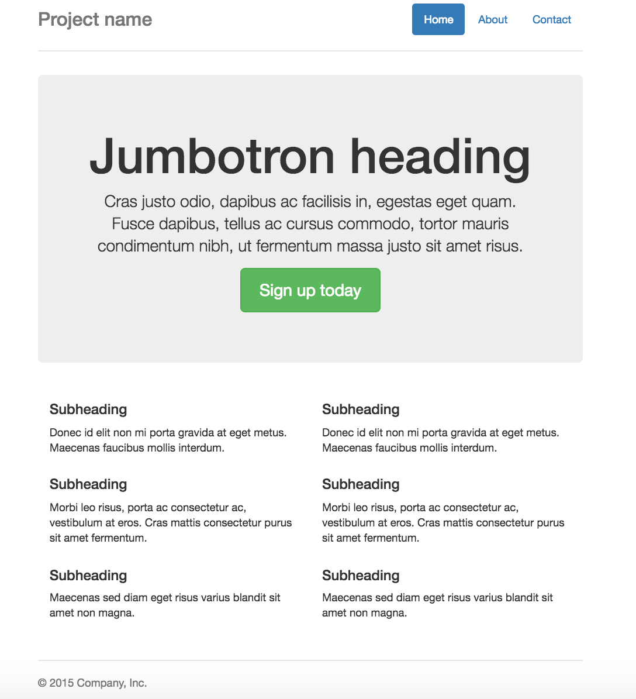

# Intermediate HTML & CSS
--

## Installation
- Install an editor of your choice. 

## Review
- Explain the difference between front-end and back-end web development.
- What does HTML stand for? And what does it do?
- What does CSS stand for? And what does it do?
- What is a tag? How is it used?
- What is a self-closing tag?
- How do you link your HTML to your CSS? Why is this necessary?

## Let's Discuss ids and classes
- What are they?
- When do you use them?

## Quick Warmup on ids and classes
- Create at least one div with an id, and four divs with a class.
- Use CSS to apply styling to the divs based on the id and class selectors.


## Element Alignment
- Inline elements can be aligned as text, so with the 'text-align' CSS property.
- Block elements can be aligned using the space around them, so with 'margin.' A margin set to auto for both left and right will center the element.

## Grouping (CSS)
- You can give the same properties to various selectors without having to repeat them.
- To do this separate selectors with commas in one line and apply the same properties to all of them.

CSS:

```
h1, .paragraph, #aboutme {
	color: blue;
}

```
## Nesting(CSS)
- This means you have a selector within another selector.

HTML:

```
<div id="top">
    <h1>Apple Pie</h1>
    <p>This is the recipe for my nonna's famous apple pie.</p>
    <p>The ingredients are: ....</p>
</div>

```
CSS:

```
#top {
    background-color: #ccc;
    padding: 1em;
}

#top h1 {
    color: #ff0;
}

#top p {
    color: red;
    font-weight: bold;
}

```

## The Grid Layout
- Most layouts operate on a 12-column grid system.
- Each column in the grid can contain nested grids itself.
- If you want a larger box, you need a greater column offset.


## Twitter Bootstrap
- "Bootstrap is the most popular HTML, CSS, and JS framework for developing responsive, mobile first projects on the web."
- Bootstrap is a front-end framework that incorporates a grid system, UI components, JavaScript widgets and more.
- The framework consists of one main CSS file, an optional theme CSS file, and a main JS file.
- Bootstrap requires jQuery to work, which is a JavaScript framework.
- To use Bootstrap you can add the CDN (content delivery network).
- Another option is to integrate the bootstrap and jquery libraries in your code base.

## Bootstrap Columns
- Columns are written in this format as a class attribute: col-(breakpoint)-(offset).
- An example of a three-column layout may be to use the class col-sm-4.
- All columns should be wrapped into an element with a class of row.
- So the complete three-column layout may look something like this:

```
<div class="row">
    <div class="col-sm-4">
        Content Here
    </div>
    <div class="col-sm-4">
        Content Here
    </div>
    <div class="col-sm-4">
        Content Here
    </div>
</div>

```

## Breakpoints
- The way that Bootstrap works is to dynamically reduce column size according to the window size.
- To be mobile-friendly, the columns will break into a stack layout after a minimum width is detected.
- The breakpoints you can select in your columns control at which point this happens.


We will be coding along a simple Bootstrap template that will help you practice the grid system.



## Linking JavaScript with HTML
- JavaScript enables interactivity with the page through animations and dynamic loading of the page.
- In order to run an external JavaScript file, you need to link it to the HTML file. This usually goes before the closing body tag:
` <script src="js/script.js"></script>`
- Just like with CSS, you can also simply add a script tag directly in your HTML file (this is what we will be doing today).

### Variables
- Allow program to remember values for a later time.
- Entity in which value is stored.
- Getting the value from a variable = accessing the variable.
- Variables start with a lower case letter, use camel case if the variable name consists of many words.

```
var price1 = 11;
var price2 = 4;
var total = price1 + price2;

```

### Alerts
- The alert() method displays an alert box with a specified message and an ok or cancel button.
- You set up an alert by placing a script tag before the closing body tag.

```
 <script>
    alert("Hello, world. Welcome to our cool new site!");
  </script>

```

### Methods
- The actions that can be performed on objects.
- There are many built-in methods in JavaScript.

Ex:

```
var message = "Hello world!";
var x = message.toUpperCase();

```
